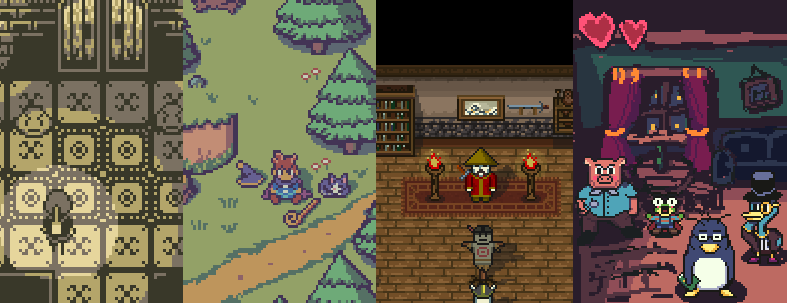

Making games, useful libraries and contributing to open source.

I'm also writing Go professionally and doing gamedev with [Ebiten](https://ebiten.org/).

## Contact / social media

___

* e-mail: [eliasdaler@protonmail.com](mailto:eliasdaler@protonmail.com) (best way to contact me)
* Mastodon: [@eliasdaler@mastodon.gamedev.place](https://mastodon.gamedev.place/@eliasdaler)
* Twitter: [@EliasDaler](https://twitter.com/EliasDaler)
* GitHub: [eliasdaler](https://github.com/eliasdaler)

## Best articles I've written

- [How to implement action sequences and cutscenes]()
- [Making and storing references to game objects (entities) in C++ and Lua]()
- [Porting my engine from SFML to SDL]()
- [Using Dear ImGui with SFML for creating awesome game dev tools]()
- [Using CMake and managing dependencies]()
- [How my little C++ meta-serialization library works and how I wrote it]()
- [LuaVela - the LuaJIT fork I've worked on]()

