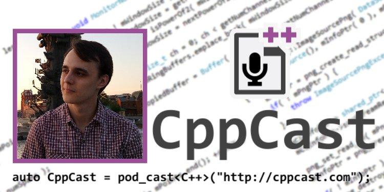

I recently gave an interview on **CppCast**!
Listen to it [here](http://cppcast.com/2016/07/elias-daler).

Here are my some thoughts about CppCast and the episode.
<!--more-->

## About CppCast

If you're never heard of **CppCast** before - it's one of the most amazing podcasts ever! The guests are always interesting and the discussions are very informative. The hosts know what to ask and what to talk about - they're C++ developers themselves.
They also get awesome guests on the show. For example, there are episodes with people like [Scott Meyers](http://cppcast.com/2015/09/scott-meyers/), [Andrei Alexandrescu](http://cppcast.com/2015/10/andrei-alexandrescu/) and [Herb Sutter](http://cppcast.com/2016/06/herb-sutter/). These people are my heroes of programming, so it's a big pleasure to be interviewed on the podcast of that caliber.

## Episode with me

I've never expected to be on the show so soon. I've joked about it: "Ah, I'll be there in *X* years when I get really successful". It's a big honor for me and I'm very thankful for Rob and Jason for making my dream of being on podcast come true.

I'm sorry if I come of kinda derpy or awkward at times during the interview. First of all, I was pretty nervous and secondly, English is not my native language and I don't speak in it in real life at all.
But still, I think I did pretty well and we discussed lots of neat stuff during the episode.

## If you want to learn about Lua/C++ integration and/or read my other blog posts

This is my new blog, so check out my [old blog](https://eliasdaler.wordpress.com) for all the mentioned articles. If you want to start with Lua and C++, check out [LuaBridge tutorial](https://eliasdaler.wordpress.com/2014/07/18/using-lua-with-cpp-luabridge/) (though I recommend to use [sol2](https://github.com/ThePhD/sol2) as a binding library). If you want to see how you can use Lua in Practice, check out [Using Lua in practice](https://eliasdaler.wordpress.com/2015/08/10/using-lua-and-cpp-in-practice/) articles (there are five of them!). And check out [Re:creation dev logs](https://eliasdaler.wordpress.com/tag/dev-log/) for in-depth explanation of what I did about the game and how I make my game engine.

The new articles are coming very soon, check out what I'm planning to write [here](https://eliasdaler.github.io/first-post) (I promised that there'll be some when the podcast airs, but I didn't think that episode will come out so soon, so sorry about that). I think these articles will be even better, there's a lot of things I've learned during the last few years.

Thanks for reading and listening. Please let me know what you thought of the episode in the comments!

