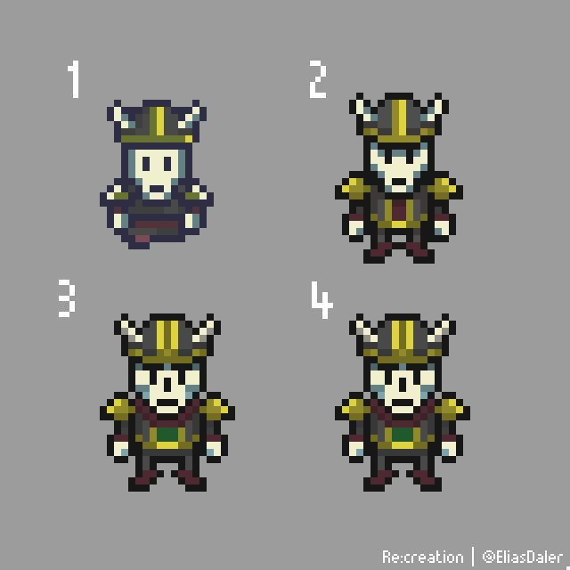
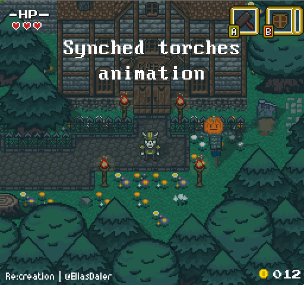
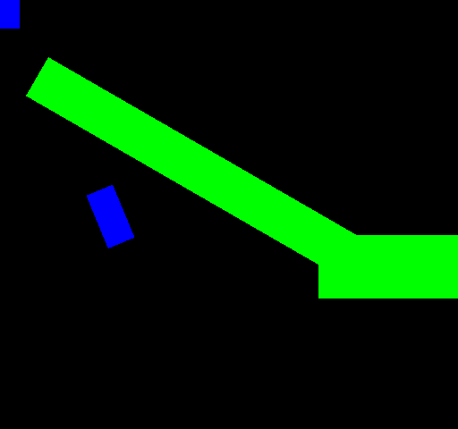

The last five months were really important for the game. It finally feels like I can work on the game itself now, not just the engine and basic systems which will let me implement different stuff in the game. It's not just abstract stuff, stuff which I do "just in case". No, I try to be pragmatic and implement things which are needed for the game and which will let me create stuff without much restrictions.

I'm very glad to say this, but I feel like the core engine is almost done. There are still some important things which I'll have to implement, but it still feels like I'm finally happy with the design I have. Mostly, it's because I've removed lots of stuff and find lots of ways to minimize my code which in the end gives me ability to implement new stuff easier and makes the whole thing easier to expand, modify and debug.

I'm finally ready to do a lot of prototyping. I've already done a lot of stuff about the game, but I still have the feeling that it's just the beginning of the "real" development! And it feels great, because I feel like I'm in total control of every aspect of the game. There are no restrictions, no boundaries. Let's see how it goes.

One more small thing: I've got a new laptop! I've had it for two weeks now. It feels really great. I'm able to do stuff a lot quicker and without frustration (having a great mood is important to be productive)! I've had my previous laptop for six years and it was slowing me down a lot. It was constantly overheating, everything was running poorly, compilation took a long time, etc... And recently I've realized how much it hurt my working process. There were lots of distractions, because even small change could take 1-2 minutes of recompilation. This means, that fast iteration was impossible. This also means that I constantly lost flow and couldn't debug quickly. Hours of slow progress made it all exhausting. Won't happen anymore!

Okay, let's begin!

# Art
I haven't done much art in the last months and most of the stuff I've done is still not finished, so I'll show them a bit later. There's a next graphics improvement coming and I'm glad that I didn't have a lot of graphics done, because I'd have to redraw tons of stuff. Let's hope it will be the last huge change!

I've improved Renatus' design and walking animation, it's nice to see how much my art improved over time:


I've also made some very small, but cool things...
Unsynched idle animations make everything look more alive!


Cat doesn't "talk" during "translation"



# Multiple tilemaps in one level

Previously the level was limited to one tile map. That meant that if I wanted to make indoor places I either had to switch to another level (which isn't fast!) or place the indoor area somewhere far away and teleport the player there. The second approach is highly used in 3d games, but I've realized that it wasn't as good in 2d tile-based games because it's harder to move tiles and you have to account for empty areas in your tilemap which are created by placing some area far away.

Eventually, I've made a decision to make levels which support multiple tilemaps. It wasn't easy to make, because lots of assumptions were made about Level having only one tilemap, but fortunately it wasn't that bad, so I've done it fairly quickly. Now I can easily switch tilemaps during the fade in / fade out effect during scene transitions.

# Input

Previously I've used polling for input, but realized that events are a lot more efficient and let me easily move all the input in Lua! One more part of game logic moved from C++ to Lua again! Great.

I've also made much better system for input in general. Now all keys can be mapped to "actions" or "axes" (plural of "axis", not "axe"!). "Actions" and "Axes" can be binded to C++ or Lua callback. This makes low-level input decoupled from game input logic in a nice way.

One advantage of event based scripting is being able to set only one callback for particular action at given time. For example, during dialogues the "Primary Action" input action will be assigned to "Skip dialogue", not "Attack/Use Primary Item", so I don't have to worry that somehow the player will be able to attack during dialogues.

My input manager now also has complete gamepad support (sticks and triggers are also supported and it's possible to connect gamepad in-game!). Event based input will later make it easy to implement replay system which will just send input events at needed times, simulating real player pressing buttons. Easy to implement and very useful for debugging!

# Moved Entity states from C++ to Lua

This is a thing that I wanted to make for a long time. Basically, most of the game logic lives in entity states. State like `MoveState`, `AttackState`, etc. Previously they were hard-coded in C++ which made them hard to modify and control with Lua. Another problem was that the more stuff I added to Lua, the harder it became for me to access stuff one Lua side.

For example, once I've implemented Action Lists in Lua, I've realized that some entity states can highly benefit from using them. But this meant that a lot of calls between Lua and C++ would happen.

Rewriting entity states was extremely easy and I've discovered and fixed a lot of bugs along the way. I've also made entity states a lot more reusable, so that different entities can use the same code while adding bits that are different. For example, the same AttackState is used by player character, enemies with melee weapons and archers!

Action lists are used to make code much easier to follow, basically the lists goes like this:
* Pre-attack animation (starting to swing a sword / aiming the arrow)
* Attack animation (continuing to swing a sword / shooting the arrow)
During this step the damage is created during some frame. For melee attackers it's defined in their AttackComponent, for archer the damage is "arrow" entity which is created on the first frame of "shoot" animation
* Post attack animation

I've also implemented multiple state machines for entities. Most of the time the entity will have only one state machine which will describe it's "main" state, but sometimes it's useful to have another state machine which will, for example, describe it's health state, so that if the entity has low health, it will play different "idle" animation.

# Private messages in event system

I've effectively used event system with global queue for quite some time, but then I've realized that it's not efficient for some events to be implemented that way. One example of this is collision callbacks. When two entities collide, each entity's onCollide function needs to be called with some additional info about which entity collided with it and maybe how it happened. In global queue each entity interested in collision event would receive this event and it would have to check if the collision happened with it or not. Of course that's a huge waste of time, so that's why I've made "private message" system which let's entities specify sender and receiver for each event and then EventManager just sends this event to receiver object.

# Improved dialogues a lot

Dialogue system got some needed improvements! One such improvement is ability to insert delays and even function calls between words! It looks like this in a text:

```json
{"SOME_TEXT_TAG" : "Hello...[DELAY 500][X] I've been waiting for you"}
```

`[DELAY 500]` creates a 500 ms delay. `[X]` indicates that the function with tag "X" will be called. In scripts, it looks something like this:

```lua
DialogueAction {
    text = {"SOME_TEXT_TAG"},
    functions = {
        x = function(talker)
            talker:setAnimation("smile")
        end
    }
}
```
I later plan to add shaking or wave effects to text for better expression of characters' emotions.

# Dev tools

I've made some useful in-game dev tools with ImGui. One such tool is in-game console which lets me execute Lua easily. Here's a little demo of it in action!



I've also made a tool for controlling time. Now it's possible to slow down and pause the game at any moment. The game doesn't slow down or stop, I just change deltaTime, so I can easily debug everything in Visual Studio.



# Removed tons of components
I've also removed a lot of components which I found redundant and easily made with other components which have much larger role. Here's what I've removed.

## Direction Component
Direction component stored just one thing: entity's direction. But that meant that to access entity's direction I had to get DirectionComponent and then get the direction. Getting component from entity isn't very fast (because it involves a `dynamic_cast` and `std::unordered_map` search) so I've just started to store entity's direction in Entity class. Yes, some entities won't have a direction (invisible entities or trees, for example), but I just assign `Direction::None` to them. Storing 1 additional byte inside of Entity isn't a big deal!

## Trigger Component

I've also removed trigger component. Previously it was used for triggers and made possible to realize the following callbacks: `onEnter`, `onStay` and `onExit`. But how did I check when to call them? I checked if trigger collides with potentially interesting entities or not... but then I've realized: why not just use `CollisionComponent` for that and make a simple entity state machine which will track entities state which are: Idle or Triggered. OnEnter is called on transition from Idle to Triggered state, onStay is called when Triggered state is active and onExit is called during transition from Triggered to Idle state. `CollisionEnter` and `CollisionExit` events trigger state transitions. This means that TriggerComponent wasn't needed anymore and I got rid of it with a huge satisfaction.

I've also made "directed" triggers which are called only when the player faces the specific direction, for example cafe has a trigger which lets player exit it when his direction is "Down".

## Interaction Component

Interaction Component was used for player-entity interactions, for example speaking with NPCs. When the player enters the "interaction area", the input changes and pressing a specific button will start dialogue. Hmmm... seems familiar, isn't it? Yes, this component isn't needed too, because I can just make a trigger which will just change the input during onEnter/onExit function calls. Using it with "directed" triggers makes it perfect, because now it's easy to make interaction possible only when the player faces the entity. (Previously it was possible to talk with NPCs while turning away from them, not cool!)

# Remade damage system

Previously when player attacked, the "damage" entity was created and then destroyed. If something collided with it, the damage was registered. But on one random forum I've found much better solution: just have "damage" rect with melee attackers all the time and activate it only during attack. Simple and much more efficient!

# SAT (Separating Axis Theorem) collision

After a lot of trying and failing, I've implemented SAT collision detection and response which will be used for some complex level geometry.


I've put my SAT implementation [here](https://gist.github.com/eliasdaler/502b54fcf1b515bcc50360ce874e81bc). Feel free to use it for your projects!

# Refactoring
I've also done **a lot** of refactoring. I'm mostly satisfied with most of my codebase, but there was some bad stuff that I needed to fix once and for all!
Mostly, I've been fixing pretty typical problems: unnecessary dependencies, some code duplication, problems with ownerships, etc. Not too much to say about that!
But the good thing about refactoring is that it just made my codebase a lot shorter. At some point it's not a refactoring anymore, it's restructuring, implementing better code, moving some stuff to Lua, etc.

**C++**: -4345 lines of code

**Lua**: +540 lines of code

**Total**: -3814 lines of code

This makes me extremely happy, because shorter and cleaner code is much easier to manage and improve. Writing negative code feels great!

# Conclusion

The last few months were very important and productive! While there wasn't a huge progress about the game itself, the engine is almost done, I'm very happy with the code and engine structure now. The next few months will be spent prototyping and making "vertical slice" of the game and I hope I'll be able to make game truly fun and enjoyable. See ya!

