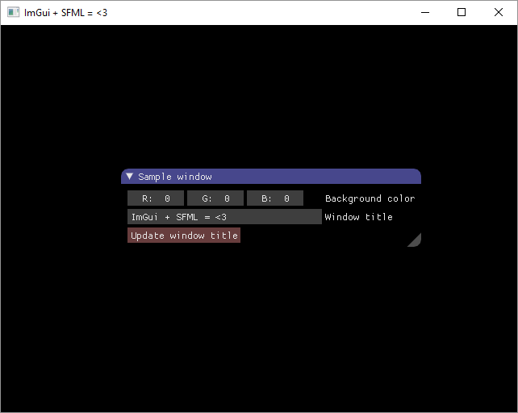
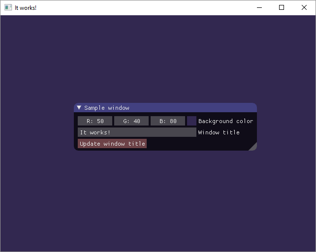

Related article: [Using ImGui with modern C++ and STL]()

___

This is the first part of tutorial about Dear ImGui (AKA ImGui) and it'll show you how to set it up with SFML. The second part will be library agnostic and will talk about common ways of doing stuff in ImGui, some awesome widgets and some useful STL overloads.






----------------

## Introduction

Having good content creation (level editor, resource editor, etc.) and debugging
tools for your game is very important and can lead to productivity and
creativity boost. Here are some examples of tools I managed to make with ImGui
for my games.






In-game Lua console:



Animation editor:



As you can see there's a wide range of widgets that ImGui provides and there are lots of other great examples of how other people use it here.

## Dear ImGui and immediate mode GUI concept

Dear ImGui is an immediate mode GUI library which makes making GUI for all kinds of tools very easy.

**Immediate mode GUI** is a bit different to what people think when they hear “GUI” (“retained mode” is a classic way of doing GUI).
Immediate mode GUI is a way of doing GUI which involves creating and drawing widgets in each frame. Instead of creating some `Button` object and adding a callback to it, you write something like

```cpp
if (ImGui::Button("Some Button")) {
    ... // code which will be called on button pressed
}
```

Simple as that!

For a great in-depth talk on this concept, I recommend to check out [Casey Muratori's talk on IMGUI](https://mollyrocket.com/861).

Back to Dear ImGui. It's:

* MIT Licensed
* Very fast and light
* Constantly updated and expanded
* Doesn't do dynamic allocation/deallocation
* Very portable – has lots of bindings for different libraries and frameworks
* Easily expandable

## Using ImGui-SFML

[ImGui-SFML](https://github.com/eliasdaler/imgui-sfml) is a binding I wrote to
simplify usage of ImGui with SFML. Here's how you can use it.

### Option A. Using ImGui-SFML with CMake


You can just see this [example](https://github.com/eliasdaler/imgui-sfml-fetchcontent) of how to use FetchContent to make it easy.


First, you need to download Dear ImGui, ImGui-SFML and build SFML somewhere.

Then, run this where you want to build ImGui-SFML:
```sh
cmake <ImGui-SFML repo folder> -DIMGUI_DIR=<ImGui repo folder> \
                               -DSFML_DIR=<path with built SFML>
```

If you have SFML installed on your system, you don't need to set SFML_DIR during
configuration.

You can also specify `BUILD_SHARED_LIBS=ON` to build ImGui-SFML as a shared library. To build ImGui-SFML examples, set `IMGUI_SFML_BUILD_EXAMPLES=ON`.

After the building, you can install the library on your system by running:
```sh
cmake --build . --target install
```

If you set `CMAKE_INSTALL_PREFIX` during configuration, you can install ImGui-SFML locally.

Integrating into your project is simple:
```cmake
find_package(ImGui-SFML REQUIRED)
target_link_libraries(my_target PRIVATE ImGui-SFML::ImGui-SFML)
```

If CMake can't find ImGui-SFML on your system (or you didn't install it), just define `ImGui-SFML_DIR` before calling `find_package`.

### Option B. Using ImGui-SFML with vcpkg and Conan


I don't maintain these packages so they might lag behind, so building `ImGui-SFML` manually is recommended


- [vcpkg package](https://vcpkg.info/port/imgui-sfml)
- [Conan package](https://bincrafters.jfrog.io/ui/packages/conan:%2F%2Fimgui-sfml?name=imgui-sfml&type=packages)

### Option C. Manual integration

This is slightly more complex...

1. Use SFML to get a simple window to show up. Follow the “Getting started” tutorial [here](http://www.sfml-dev.org/tutorials/2.3/) if you have never done it before.
2. Download [Dear ImGui](https://github.com/ocornut/imgui).
3. Download [ImGui-SFML](https://github.com/eliasdaler/imgui-sfml).

    **Important**: you have to add the contents of **imconfig-SFML.h** to ImGui's **imconfig.h** to get implicit `ImVec2`  `sf::Vector2f` conversion working!
    {: .message}

4. Add ImGui and ImGui-SFML directories to your include directories.
5. Add these files to your build / project:
    * imgui.cpp
    * imgui_draw.cpp
    * imgui_widgets.cpp
    * imgui-SFML.cpp
    * imgui_demo.cpp
6. (Optional) If you get linking errors, link OpenGL to your project.

Here's a complete example of using ImGui and SMFL together.

```cpp
#include "imgui.h"
#include "imgui-SFML.h"

#include <SFML/Graphics/CircleShape.hpp>
#include <SFML/Graphics/RenderWindow.hpp>
#include <SFML/System/Clock.hpp>
#include <SFML/Window/Event.hpp>

int main() {
    sf::RenderWindow window(sf::VideoMode(640, 480), "ImGui + SFML = <3");
    window.setFramerateLimit(60);
    ImGui::SFML::Init(window);

    sf::CircleShape shape(100.f);
    shape.setFillColor(sf::Color::Green);

    sf::Clock deltaClock;
    while (window.isOpen()) {
        sf::Event event;
        while (window.pollEvent(event)) {
            ImGui::SFML::ProcessEvent(window, event);

            if (event.type == sf::Event::Closed) {
                window.close();
            }
        }

        ImGui::SFML::Update(window, deltaClock.restart());

        ImGui::Begin("Hello, world!");
        ImGui::Button("Look at this pretty button");
        ImGui::End();

        window.clear();
        window.draw(shape);
        ImGui::SFML::Render(window);
        window.display();
    }

    ImGui::SFML::Shutdown();
}
```

You'll see something like this:



Try to change some stuff. Double click on r/g/b field to set values precisely, or just drag some widgets to change window's background color. Press the button to change window title.
Here, it works!


Awesome! Now let's see how it works.

ImGui is initialized by calling `ImGui::SFML::Init` function to which you pass your `sf::RenderWindow`. This creates internal default font atlas. See how you can use other fonts in [Fonts how-to section](https://github.com/eliasdaler/imgui-sfml#fonts-how-to) of imgui-sfml's README.

Shutting down is done with `ImGui::SFML::Shutdown` call which cleans some things up. (Deleting internal font atlas, if it's used, for example).

There are two phases of using ImGui in your game loop: **update** and **render**.

**Updating** consists of *event processing*, *state update* and *widget update*. Event processing is done by calling `ImGui::SFML::ProcessEvent` and it's almost the same as processing SFML events. It's used to process keyboard and mouse input and handle window resize and focus events. State update (which is being done by calling `ImGui::SFML::Update`) updates delta time which ImGui uses internally, so you have to pass it using your delta time clock, as well as mouse coordinates (or your window relative to which mouse coordinates will be taken). `ImGui::NewFrame` is also being called here and you can call ImGui widget creation functions after that. Calling stuff like `ImGui::Button` or `ImGui::Color3Edit` updates widgets and it also generates one draw list which is used for rendering later.

**Drawing** is done with `ImGui::SFML::Render` call.


Don't call `ImGui::Render`, only call `ImGui::SFML::Render`



You must create all widgets between `ImGui::SFML::Update()` and `ImGui::Render()`.


If you're updating more than you draw, then you can either update ImGui once per frame or call `ImGui::EndFrame` at the end of your update function.

Widgets are easily created by calling corresponding functions (more about them in the next part). For example, you can call `ImGui::InputInt` and pass a pointer to int there.When you change widget's value, the integer is changed too.
Buttons work pretty easy too – they don't need callbacks, you just wrap code which you want to call after the button is pressed in `if(ImGui::Button(…)) { … }` and that's all you have to do.

Call `ImGui::ShowTestWindow` somewhere when you create widgets and you'll get a nice window with lots of examples of ImGui stuff. This is very useful as example of how to do stuff with ImGui. Just look for the thing you want to make in this test window and you'll easily find how to do it in corresponding part of imgui_demo.cpp.

## Useful overloads for SFML

There are also some useful overloads implemented in SFML ImGui binding. For example, you can use `ImGui::Image` and `ImGui::ImageButton` with `sf::Textures` and `sf::Sprites`! I've also defined implicit conversions between `ImVec2` and `sf::Vector2f`, so you can pass `sf::Vector2f` to ImGui's functions without needing to cast explicitly. You can also draw lines and rects with `DrawLine`, `DrawRect`, `DrawRectFilled`.

## Conclusion

As you can see, using ImGui is easy and it's easy to start doing really impressive and useful stuff with it right away. Thank you for reading this tutorial, I hope it was useful and that ImGui will help you make better tools and greater games as the result of having awesome tools.

